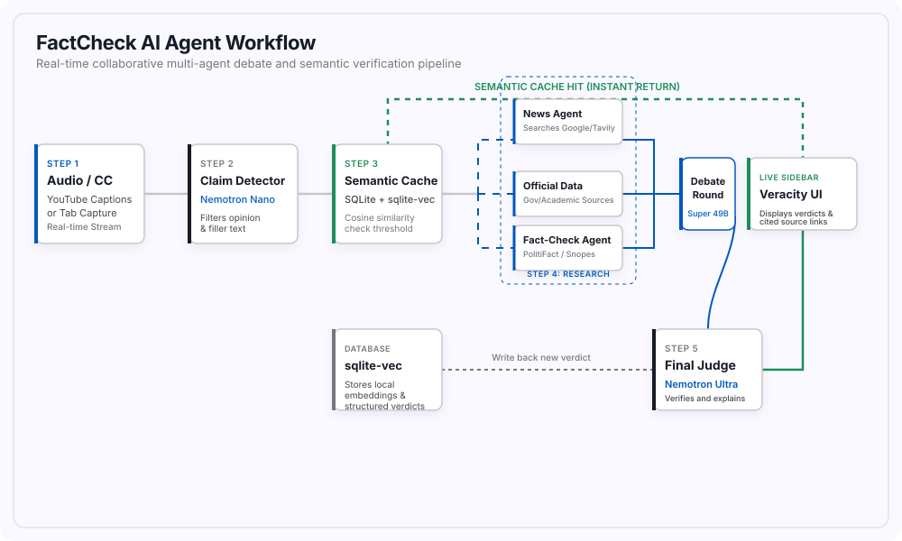

<div align="center">


# FactCheck AI

**Real-time, multi-agent fact-checking for the videos you're already watching.**

[](LICENSE)
[](https://www.python.org/)
[](https://developer.chrome.com/docs/extensions/mv3/intro/)
[]()

</div>

---

FactCheck AI is a browser extension and local backend that watches the video playing in your active tab, listens for spoken factual claims, and automatically researches them in the background using a team of cooperating AI agents — surfacing a verdict, with sources, directly on the page, without ever pausing your video.

It is built specifically for political speeches, debates, and news broadcasts, where a claim is made once, in passing, and the viewer has no realistic way to check it in the moment.

---

## Table of Contents

- [How It Works](#how-it-works)
- [Features](#features)
- [Architecture](#architecture)
- [Technology Stack](#technology-stack)
- [Getting Started](#getting-started)
- [Usage](#usage)
- [Project Structure](#project-structure)
- [Roadmap](#roadmap)
- [Contributing](#contributing)
- [License](#license)
- [Developers](#developers)

---

## How It Works

1. **Listen** — the extension reads existing closed captions when available, or falls back to capturing tab audio and transcribing it locally.
2. **Detect** — a lightweight model continuously scans the transcript and flags sentences that are actual, checkable factual claims (filtering out opinion, jokes, and filler).
3. **Check the cache** — each new claim is compared against previously verified claims using semantic similarity, so a differently-worded repeat of a claim already checked returns instantly, with zero new research.
4. **Research** — for genuinely new claims, three agents investigate in parallel from different angles: general news coverage, official/government data, and existing fact-checking sources.
5. **Debate** — the three agents review each other's findings in a single round and revise their own conclusions where warranted.
6. **Judge** — a final, stronger model synthesizes the debate into one verdict, with a plain-language explanation and the actual sources used.
7. **Surface** — the verdict appears in an on-page overlay within seconds, color-coded and ready to expand for the full explanation and citations.

<div align="center">
  
</div>

## Features

| | |
|---|---|
| **Real-Time Claim Detection** | Monitors closed captions or live tab audio to identify testable factual claims as they're spoken. |
| **Multi-Agent Research Pipeline** | Dispatches three parallel research agents, each investigating a claim from a distinct angle. |
| **Collaborative Debate Round** | Agents cross-reference each other's evidence and revise their stance before a verdict is reached. |
| **Final Judge Verdict** | A dedicated judge model synthesizes the debate into one of four clear outcomes: `SUPPORTED`, `CONTRADICTED`, `MIXED`, or `UNVERIFIABLE`. |
| **Semantic Caching** | Uses `sqlite-vec` to instantly recall verdicts for previously checked claims via vector similarity, even when reworded — saving both time and API usage. |
| **Non-Intrusive Overlay** | A calm, modern sidebar injected via Shadow DOM, fully style-isolated from the host page, showing a live feed of claims and verdicts. |

## Architecture

FactCheck AI is composed of two cooperating layers, connected over a single persistent WebSocket connection.

### Browser Extension (Frontend)

Built with plain HTML, CSS, and vanilla JavaScript on Manifest V3 — no build step, no framework.

- **Content Script** — locates the video element, reads caption text when available, and renders the overlay UI inside a Shadow DOM to stay visually isolated from the host page.
- **Offscreen Document** — the fallback path used only when no captions exist; captures raw tab audio and segments it using Voice Activity Detection so each chunk sent for transcription is one complete spoken phrase.
- **Background Service Worker** — holds the persistent WebSocket connection to the backend, sending a keepalive ping every 20 seconds (required to keep an MV3 service worker alive on Chrome 116+) and relaying messages between the page and the server.

### Python Backend (Server)

Built with **FastAPI** and **Pydantic AI**, orchestrated with `asyncio`.

- **WebSocket Server** — ingests caption/audio data and streams real-time status updates and verdicts back to the extension.
- **Speech-to-Text** — transcribes and natively translates raw audio chunks via Groq's Whisper API, used only when captions aren't available.
- **Claim Detection** *(Llama 3.1)* — a single batched call per transcript window, filtering for genuinely checkable factual claims.
- **Parallel Research** *(Llama 3.1)* — three tool-calling agents gather evidence via web search, each from a different angle.
- **Collaborative Debate** *(Llama 3.1)* — agents review each other's research and revise their positions in one round.
- **The Judge** *(Llama 3.1)* — produces the final structured verdict, explanation, and source list.
- **Semantic Cache** — a local SQLite database extended with `sqlite-vec`, storing every claim's embedding and verdict for instant future recall.

## Technology Stack

| Layer | Technology |
|---|---|
| Language Models | Llama 3.1 via NVIDIA NIM, NV-EmbedQA |
| Speech-to-Text | Whisper-large-v3-turbo via Groq |
| Agent Orchestration | Pydantic AI, Python `asyncio` |
| Backend Framework | FastAPI |
| Caching / Storage | SQLite + `sqlite-vec` |
| Web Search | Tavily / DuckDuckGo |
| Frontend | HTML5, CSS3, Vanilla JavaScript |
| Extension Platform | Chrome Manifest V3 |

## Getting Started

### Prerequisites

- **Python 3.11+**
- **Google Chrome**, version 116 or later
- An **NVIDIA API key**, free from [build.nvidia.com](https://build.nvidia.com)
- A **Groq API key**, free from [console.groq.com](https://console.groq.com)
- *(Optional)* A **Tavily API key**, for enhanced web search — DuckDuckGo is used otherwise

### 1. Set Up the Backend

```bash
cd backend

# Create and activate a virtual environment
python -m venv .venv
source .venv/bin/activate        # Windows: .venv\Scripts\activate

# Install dependencies
pip install -r requirements.txt

# Configure environment variables
cp .env.example .env
```

Edit `.env` with your keys:

```env
NVIDIA_API_KEY=your_nvidia_api_key_here
TAVILY_API_KEY=your_tavily_api_key_here   # optional
```

Start the server:

```bash
uvicorn main:app --host 127.0.0.1 --port 8000
```

### 2. Install the Browser Extension

1. Open Chrome and go to `chrome://extensions/`.
2. Enable **Developer mode** (top-right toggle).
3. Click **Load unpacked** and select the `extension/` folder.
4. Pin the FactCheck AI icon to your toolbar.

## Usage

1. Open any video with spoken political or factual content (e.g. a news broadcast or speech) on YouTube.
2. Click the FactCheck AI icon to open the overlay.
3. As the video plays, claims populate the feed automatically, moving through `Checking → Researching → Debating` before resolving to a final, color-coded verdict with cited sources.

## Project Structure

```text
FactCheck_AI/
├── extension/
│   ├── manifest.json        # Extension manifest configuration
│   ├── background/
│   │   └── service-worker.js# WebSocket relays, keepalives, background listener
│   ├── content/
│   │   ├── content-script.js# Injects overlay panel into Shadow DOM
│   │   └── overlay.css      # Isolated styles for overlay UI
│   ├── offscreen/
│   │   ├── offscreen.html
│   │   └── offscreen.js     # Web Audio API tab capture and VAD chunking
│   ├── icons/               # Logo icons (16px, 32px, 48px, 128px)
│   └── popup/
│       ├── popup.html
│       ├── popup.js         # Settings & controls panel
│       └── popup.css
├── backend/
│   ├── main.py              # FastAPI app setup and WebSocket routing
│   ├── session.py           # Client connection session state manager
│   ├── stt.py               # Speech-to-text integration
│   ├── claim_detection.py   # Claim validation and filtering (Nemotron Nano)
│   ├── cache.py             # SQLite + sqlite-vec semantic cache
│   ├── queue_manager.py     # Asynchronous processing queue worker pool
│   ├── config.py            # Environment variables & constants configuration
│   ├── schemas.py           # Shared Pydantic data schemas
│   ├── requirements.txt     # Python backend dependencies
│   ├── start.bat            # Windows script to launch backend server
│   └── agents/
│       ├── research_agent.py# Research logic utilizing Tavily search
│       ├── debate.py        # Multi-agent stance debate logic
│       └── judge.py         # Synthesizes final verdict, reasoning, and sources
├── tests/                   # Relocated verification test scripts
├── LICENSE                  # GNU General Public License v3.0
├── README.md
├── logo.png                 # Main project logo
└── start.bat                # Root runner script to boot backend server
```

## Roadmap

- [ ] Support for additional languages beyond English
- [ ] Per-user API key support for multi-user / public release
- [ ] Always-on cloud-hosted backend option
- [ ] Support for additional video platforms beyond YouTube

## Contributing

Contributions, issues, and feature suggestions are welcome. If you'd like to contribute:

1. Fork the repository
2. Create a feature branch (`git checkout -b feature/your-feature`)
3. Commit your changes with a clear message
4. Open a pull request describing what changed and why

Please keep pull requests focused on a single change where possible, and follow the existing code style.

## License

This project is licensed under the **GNU General Public License v3.0**. See [LICENSE](LICENSE) for the full text.

## Developers

- **Nisarg Patel** — [GitHub](https://github.com/nisargpatel1906)
- **Kathan Shah** — [GitHub](https://github.com/kathan472)
